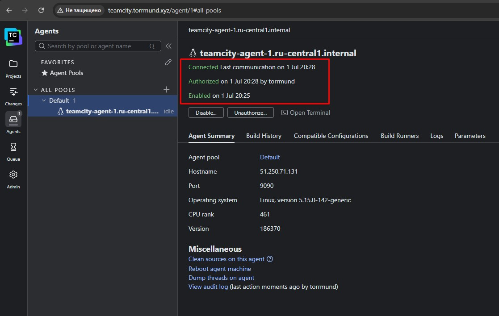
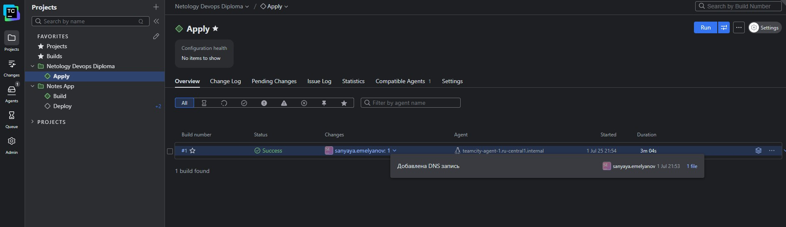

# Дипломный практикум Yandex.Cloud курса DevOps (Нетология)

---

## Цели:

1. Подготовить облачную инфраструктуру на базе облачного провайдера Яндекс.Облако.
2. Запустить и сконфигурировать Kubernetes кластер.
3. Установить и настроить систему мониторинга.
4. Настроить и автоматизировать сборку тестового приложения с использованием Docker-контейнеров.
5. Настроить CI для автоматической сборки приложения.
6. Настроить CD для автоматического развёртывания приложения.

---

## Краткое описание проекта

### Зависимости

Для корректного запуска проекта потребуется наличие в системе:

| Package                         | Version         |
| ------------------------------- | --------------- |
| terraform                       | ~>1.11.0        |
| ansible                         | >=2.13.13(core) |
| YC CLI                          | >=0.147.0       |
| Helm CLI                        | >=v3.17.3       |
| Kubectl                         | >=v1.30.0       |
| Дистрибутив TeamCity | 2025.03.3       |

### Описание проекта

Проект реализован в виде двух репозиториев:

* [netology-devops-diploma](https://github.com/Torrmund/netology-devops-diploma) - Проект управления инфраструктурой (содержит данный README)
* [notes-app](https://github.com/Torrmund/notes-app) - Проект демо-приложения для практикума. Представляет собой Python(flask) приложение для создания заметок. Репозиторий содержит также Helm-чарт для деплоя приложения в k8s кластер. Для работы приложения требуется подключение к СУБД PostgreSQL.

Состав репозитория netology-devops-diploma:

* [nerology-devops-diploma/backend-prepare](https://github.com/Torrmund/netology-devops-diploma/tree/main/backend-prepare) - Terraform проект для подготовки backend-а проекта infrastructure. Создает S3 бакет и ключ шифрования для него; Сервисный аккаунт, от имени которого будет работать проект infrastructure, и ключи для него; Базу данных YDB и таблицу в ней для хранения state-lock файла.
* [netology-devops-diploma/infrastructure](https://github.com/Torrmund/netology-devops-diploma/tree/main/infrastructure) - Terraform проект для создания всей необходимой инфраструктуры для развертывания демо-приложения и CI/CD конвейера. Создает VPC, сервисные аккаунты, container-registry, k8s кластер, DNS зону и записи к ней, ВМ для развертывания TeamCity и пр;
  Генерирует различные файлы конфигураций для инфраструктуры (в том числе kubeconfig для доступа к кластеру);
  Деплоит в кластер k8s систему мониторинга на базе kube-prometheus-stack, nginx-ingress-controller, СУБД PostgreSQL;
  Генерирует inventory, а также содержит ansible-playbook для развертывания TeamCity на поднятых для этого ВМ.
* [netology-devops-doploma/.teamcity](https://github.com/Torrmund/netology-devops-diploma/tree/main/.teamcity) - Содержит конфигурацию TeamCity(в виде Kotlin DSL для следования методологии IaC) при помощи которого реализуется CI/CD конвейер для Terraform проекта infrastructure. Конвейер реализован таким образом, что при любом коммите в main ветку выполняется apply с сохранением в виде артефакта плана для Terraform проекта infrastructure.

Состав репозитория notes-app:

* [notes-app/app](https://github.com/Torrmund/notes-app/tree/main/app) - Исходный код демо-приложения
* [notes-app/charts/noteapp](https://github.com/Torrmund/notes-app/tree/main/charts/noteapp) - Helm-чарт для деплоя приложения в k8s кластер
* [notes-app/.teamcity](https://github.com/Torrmund/notes-app/tree/main/.teamcity) - Содержит конфигурацию TeamCity для реализации CI/CD конвейера демо-приложения (сборка по особым правилам docker-образа и его пуш в регистри / деплой приложения в k8s кластер ). Конвейер реализован таким образом, что при любом коммите в main ветку репозитория notes-app собирается и пуштся в регистри образ, тегом которого выступает хэш коммита, а при пуше в репозиторий тега - собирается образ с этим тегом и выполняется деплой приложения в k8s кластер.

---

## Запуск/Использование проекта

Склонируйте себе проект:

`git clone https://github.com/Torrmund/netology-devops-diploma.git `

### Создание сервисного аккаунта для backend-prepare

Backend для проекта infrastructure должен создаваться при помощи сервисного аккаунта. Поэтому для начала следует создать этот самый сервисный аккаунт и назначить ему необходимые права в каталоге, а также получить его ключи для использования в Terraform проекте backend-prepare.

Сервисный аккаунт можно создать как через GUI, так и через YC CLI.
СА необходимо наделить следующими правами в каталоге:

* kms.admin - для создания ключа шифрования S3 бакета;
* resource-manager.admin - для назначения прав в директории создаваемым сервисным аккаунтам;
* iam.serviceAccounts.admin - для создания сервисных аккаунтов;
* ydb.admin - для создания БД YDB и таблицы в ней;
* storage.editor - для создания S3 бакета.

| Скриншот созданного SA       |
| ---------------------------------------------- |
|  |

Затем необходимо для этого SA создать ключи:

* Статический ключ доступа - Используется провайдером AWS для создания нужной таблицы в YDB
* Авторизованный ключ в формате json - Используется провайдером yandex-cloud для доступа к облаку

Эти ключи необходимо сохранить в виде отдельных файлов, т.к. пути к этим файлам потребуются для запуска проекта backend-prepare.

ВАЖНО!!!
Статический ключ доступа необходимо сохранить в aws-типизированном формате:

| Пример                                   |
| ---------------------------------------------- |
|  |

### Подготовка окружения для запуска backend-prepare

Перед запуском проекта, настройте переменные:

* personal.auto.tfvars - По примеру из файла personal.auto.tfvars.example
* public.auto.tfvars - Поменять в нем, при необходимости, нужно только названия S3 бакета и YDB БД и таблицы (значения остальных переменных оставить как есть)

Для настройки самых важный параметров проект backend-prepare содержит bash-скрипт setup-env.sh. Настоятельно рекомендуется им воспользоваться:

```
Использование: ./setup-env.sh -c <credentials_file> -k <authorized_key.json> -C <cloud_id> -f <folder_id>

Опции:
  -c, --credentials PATH      Путь к файлу .aws/credentials
  -k, --keyfile PATH          Путь к файлу authorized_key.json
  -C, --cloud-id VALUE        Значение переменной cloud_id для Terraform
  -f, --folder-id VALUE       Значение переменной folder_id для Terraform
  -h, --help                  Показать эту справку
```

Пример использования:

```
emav@compute-vm-homework:~/netology-devops-diploma/backend-prepare$ source ./setup-env.sh -c ~/.aws/credentials -k ~/.aws/authorized_key.json -C "b1..." -f "b1g...."
Переменные окружения успешно установлены.
Конфигурация Yandex Cloud CLI обновлена
```

ВАЖНО!!!

На данном этапе, если у вас есть проблемы с установкой провайдеров Terraform без использования VPN, то предлагается создать в домашней директории файл .terraformrc с содержимым:

```
provider_installation {
  network_mirror {
    url = "https://registry.comcloud.xyz/"
  }
}
```

### Инициализация/запуск backend-prepare

После подготовки ключей SA и окружения можно приступать к инициализации и запуску проекта backend-prepare:

Перейдите в директорию backend-prepare и выполните `terraform init `

Пример:

```
emav@compute-vm-homework:~/netology-devops-diploma/backend-prepare$ terraform init
Initializing the backend...
Initializing provider plugins...
- Finding hashicorp/time versions matching "0.13.1"...
- Finding yandex-cloud/yandex versions matching "0.140.1"...
- Finding hashicorp/aws versions matching "6.0.0"...
- Finding hashicorp/local versions matching "2.5.2"...
- Finding hashicorp/null versions matching "3.2.4"...
- Installing hashicorp/time v0.13.1...
- Installed hashicorp/time v0.13.1 (verified checksum)
- Installing yandex-cloud/yandex v0.140.1...
- Installed yandex-cloud/yandex v0.140.1 (verified checksum)
- Installing hashicorp/aws v6.0.0...
- Installed hashicorp/aws v6.0.0 (verified checksum)
- Installing hashicorp/local v2.5.2...
- Installed hashicorp/local v2.5.2 (verified checksum)
- Installing hashicorp/null v3.2.4...
- Installed hashicorp/null v3.2.4 (verified checksum)
Terraform has created a lock file .terraform.lock.hcl to record the provider
selections it made above. Include this file in your version control repository
so that Terraform can guarantee to make the same selections by default when
you run "terraform init" in the future.

╷
│ Warning: Incomplete lock file information for providers
│ 
│ Due to your customized provider installation methods, Terraform was forced to calculate lock file checksums locally for the following providers:
│   - hashicorp/aws
│   - hashicorp/local
│   - hashicorp/null
│   - hashicorp/time
│   - yandex-cloud/yandex
│ 
│ The current .terraform.lock.hcl file only includes checksums for linux_amd64, so Terraform running on another platform will fail to install these providers.
│ 
│ To calculate additional checksums for another platform, run:
│   terraform providers lock -platform=linux_amd64
│ (where linux_amd64 is the platform to generate)
╵
Terraform has been successfully initialized!

You may now begin working with Terraform. Try running "terraform plan" to see
any changes that are required for your infrastructure. All Terraform commands
should now work.

If you ever set or change modules or backend configuration for Terraform,
rerun this command to reinitialize your working directory. If you forget, other
commands will detect it and remind you to do so if necessary.
```

После успешной инициализации можно выполнять `terraform apply`

Примеры:

```
  # yandex_ydb_database_serverless.state_ydb will be created
  + resource "yandex_ydb_database_serverless" "state_ydb" {
      + created_at            = (known after apply)
      + database_path         = (known after apply)
      + deletion_protection   = false
      + document_api_endpoint = (known after apply)
      + folder_id             = "b1gb778cdjo78rc8eqoq"
      + id                    = (known after apply)
      + location_id           = "ru-central1"
      + name                  = "netology-diploma-tfstate-lock"
      + sleep_after           = 0
      + status                = (known after apply)
      + tls_enabled           = (known after apply)
      + ydb_api_endpoint      = (known after apply)
      + ydb_full_endpoint     = (known after apply)

      + serverless_database (known after apply)
    }

Plan: 20 to add, 0 to change, 0 to destroy.

Changes to Outputs:
  + sa_authorized_key_path = "../infrastructure/.yc/infrastructure_sa_key.json"
  + sa_static_key_path     = "../infrastructure/.yc/infrastructure_sa_credentials"
  + state_backet_name      = "netology-diploma-tfstate"
  + state_ydb_table_name   = "netology-diploma-tfstate-lock-table"
  + ydb_endpoint           = (known after apply)

Do you want to perform these actions?
  Terraform will perform the actions described above.
  Only 'yes' will be accepted to approve.

  Enter a value: 
```

```
null_resource.infrastructure_sa_key: Creation complete after 2s [id=1216686273388909835]
time_sleep.wait_for_ydb: Still creating... [20s elapsed]
time_sleep.wait_for_ydb: Still creating... [30s elapsed]
time_sleep.wait_for_ydb: Creation complete after 30s [id=2025-07-01T18:57:51Z]
aws_dynamodb_table.state_ydb_table: Creating...
aws_dynamodb_table.state_ydb_table: Creation complete after 1s [id=netology-diploma-tfstate-lock-table]

Apply complete! Resources: 20 added, 0 changed, 0 destroyed.

Outputs:

sa_authorized_key_path = "../infrastructure/.yc/infrastructure_sa_key.json"
sa_static_key_path = "../infrastructure/.yc/infrastructure_sa_credentials"
state_backet_name = "netology-diploma-tfstate"
state_ydb_table_name = "netology-diploma-tfstate-lock-table"
ydb_endpoint = "https://docapi.serverless.yandexcloud.net/ru-central1/b1gmlu2hfoi2rdhigrb4/etnpp2hpseqed605t50k"
```

ВАЖНО!!!

Значения Outputs переменных понадобятся для инициализации проекта infrastructure.
Также, проект backend-prepare автоматически создает и прокидывает ключи SA для проекта infrastructure по пути, указанному в соответствующих Outputs переменных.

После успешного apply можно через GUI удостовериться, что необходимая для backend-а инфраструктура поднялась:

| Скриншот                               |
| ---------------------------------------------- |
|  |

### Подготовка окружения для запуска infrastructure

После создания всей инфраструктуры для Terraform-проекта infrastructure, требуется настроить окружение для его запуска.
Перейдите в проект infrastructure и настройте:

* В файле providers.tf актуализируйте настройки backend-а, используя значения Outputs переменных из backend-prepare.
* Сформируйте файл personal.auto.tfvars по примеру из personal.auto.tfvars.example
* В файле public.auto.tfvars, при необходимости, можете скорректировать значения переменных, связанных с создаваемыми ресурсами (но не изменяйте переменные, связанные с ключами сервисных аккаунтов), а также доменной зоной и доменами (ВАЖНО!!! на данном этапе необходимо делегировать свой домен в YC).
* Воспользуйтесь bash-скриптом setup-env.sh в проекте infrastructure для настройки самых важных параметров:

  ```
  emav@compute-vm-homework:~/netology-devops-diploma/infrastructure$ ./setup-env.sh -h
  Использование: ./setup-env.sh -c <credentials_file> -k <authorized_key.json> -C <cloud_id> -f <folder_id> -K <kubeconfig_filepath>

  Опции:
    -c, --credentials PATH      Путь к файлу aws-типизированных кредов SA (по умолчанию: ./.yc/infrastructure_sa_credentials)
    -k, --keyfile PATH          Путь к файлу статического ключа SA (по умолчанию: ./.yc/infrastructure_sa_key.json)
    -C, --cloud-id VALUE        Значение переменной cloud_id для Terraform
    -f, --folder-id VALUE       Значение переменной folder_id для Terraform
    -K, --kubeconfig-file PATH  Путь к файлу kubeconfig (по умолчанию: ./.kube/kube_config)
    -h, --help                  Показать эту справку
  ```

  Если в проекте backend-prepare вы не меняли пути для сохранения ключей SA infrastructure, то следует оставить по значения по умолчанию для переменных, где это предусмотрено, т.е. передать в скрипт только cloud_id и folder_id.
  Пример использования:

  ```
  emav@compute-vm-homework:~/netology-devops-diploma/infrastructure$ source ./setup-env.sh -C "b1g..." -f "b1g..."
  ВНИМАНИЕ: Файл ./.kube/kube_config не найден.
  Переменные окружения успешно установлены.
  Конфигурация Yandex Cloud CLI обновлена
  ```
* Скачайте дистрибутив TeamCity нужной версии. Удостоверьтесь, что переменная `teamcity_distro_filepath` указывает путь к архиву с дистрибутивом

### Запуск/Использование проекта infrastructure

После настройки окружения, можно приступать к инициализации и запуску проекта infrastucture.

Удостоверьтесь, что вы находитесь в директории infrastructure.

Выполните команду `terraform init`

Пример:

```
emav@compute-vm-homework:~/netology-devops-diploma/infrastructure$ terraform init
Initializing the backend...

Successfully configured the backend "s3"! Terraform will automatically
use this backend unless the backend configuration changes.
Initializing provider plugins...
- Finding yandex-cloud/yandex versions matching "0.140.1"...
- Finding hashicorp/local versions matching "2.5.2"...
- Finding hashicorp/helm versions matching "3.0.1"...
- Finding hashicorp/kubernetes versions matching "2.37.1"...
- Finding gavinbunney/kubectl versions matching "1.19.0"...
- Finding latest version of hashicorp/null...
- Installing yandex-cloud/yandex v0.140.1...
- Installed yandex-cloud/yandex v0.140.1 (verified checksum)
- Installing hashicorp/local v2.5.2...
- Installed hashicorp/local v2.5.2 (verified checksum)
- Installing hashicorp/helm v3.0.1...
- Installed hashicorp/helm v3.0.1 (verified checksum)
- Installing hashicorp/kubernetes v2.37.1...
- Installed hashicorp/kubernetes v2.37.1 (verified checksum)
- Installing gavinbunney/kubectl v1.19.0...
- Installed gavinbunney/kubectl v1.19.0 (verified checksum)
- Installing hashicorp/null v3.2.4...
- Installed hashicorp/null v3.2.4 (verified checksum)
Terraform has created a lock file .terraform.lock.hcl to record the provider
selections it made above. Include this file in your version control repository
so that Terraform can guarantee to make the same selections by default when
you run "terraform init" in the future.

╷
│ Warning: Incomplete lock file information for providers
│ 
│ Due to your customized provider installation methods, Terraform was forced to calculate lock file checksums locally for the following providers:
│   - gavinbunney/kubectl
│   - hashicorp/helm
│   - hashicorp/kubernetes
│   - hashicorp/local
│   - hashicorp/null
│   - yandex-cloud/yandex
│ 
│ The current .terraform.lock.hcl file only includes checksums for linux_amd64, so Terraform running on another platform will fail to install these providers.
│ 
│ To calculate additional checksums for another platform, run:
│   terraform providers lock -platform=linux_amd64
│ (where linux_amd64 is the platform to generate)
╵
Terraform has been successfully initialized!

You may now begin working with Terraform. Try running "terraform plan" to see
any changes that are required for your infrastructure. All Terraform commands
should now work.

If you ever set or change modules or backend configuration for Terraform,
rerun this command to reinitialize your working directory. If you forget, other
commands will detect it and remind you to do so if necessary.
```

После успешной инициализации можно выполнять `terraform apply`

Примеры:

```
  + teamcity_install_agents  = <<-EOT
        После инициализации мастера, запусти установку и настройку агентов:
        'ansible-playbook -i ansible/inventory/teamcity_inventory.yml ansible/teamcity_install.yml -l teamcity_agents'
    EOT
  + teamcity_url             = "http://teamcity.torrmund.xyz"
  + ycr_id                   = (known after apply)


Invalid attribute in provider configuration

  with provider["registry.terraform.io/hashicorp/kubernetes"],
  on providers.tf line 57, in provider "kubernetes":
  57: provider "kubernetes" {

'config_path' refers to an invalid path: "./.kube/kube_config": stat ./.kube/kube_config: no such file or directory


Do you want to perform these actions?
  Terraform will perform the actions described above.
  Only 'yes' will be accepted to approve.

  Enter a value: 
```

```
null_resource.get_kube_config (local-exec): Готово! Kubeconfig для сервисного аккаунта сохранён в ./.kube/kube_config
null_resource.get_kube_config: Creation complete after 3s [id=5394468042026244558]
kubernetes_namespace.monitoring: Creating...
kubernetes_namespace.ingress: Creating...
kubernetes_namespace.demo_app_namespace: Creating...
╷
│ Error: Post "http://localhost/api/v1/namespaces": dial tcp [::1]:80: connect: connection refused
│ 
│   with kubernetes_namespace.monitoring,
│   on monitoring.tf line 1, in resource "kubernetes_namespace" "monitoring":
│    1: resource "kubernetes_namespace" "monitoring" {
│ 
╵


Invalid attribute in provider configuration

  with provider["registry.terraform.io/hashicorp/kubernetes"],
  on providers.tf line 57, in provider "kubernetes":
  57: provider "kubernetes" {

'config_path' refers to an invalid path: "./.kube/kube_config": stat ./.kube/kube_config: no such file or directory

╷
│ Error: Post "http://localhost/api/v1/namespaces": dial tcp [::1]:80: connect: connection refused
│ 
│   with kubernetes_namespace.ingress,
│   on ingress-controller.tf line 1, in resource "kubernetes_namespace" "ingress":
│    1: resource "kubernetes_namespace" "ingress" {
│ 
╵
╷
│ Error: Post "http://localhost/api/v1/namespaces": dial tcp [::1]:80: connect: connection refused
│ 
│   with kubernetes_namespace.demo_app_namespace,
│   on postgresql.tf line 1, in resource "kubernetes_namespace" "demo_app_namespace":
│    1: resource "kubernetes_namespace" "demo_app_namespace" {
│ 
╵
```

ВАЖНО!!!
Данные ошибки - ожидаемое поведение, потому как kubeconfig формируется в процессе выполнения проекта, а провайдеры инициализируются еще на этапе `plan`. Просто запустите `terraform apply` еще раз.

```
      + zone_id = "dns2acbi2p5bltidjpee"
    }

  # yandex_dns_recordset.notes-app will be created
  + resource "yandex_dns_recordset" "notes-app" {
      + data    = (known after apply)
      + id      = (known after apply)
      + name    = "notes"
      + ttl     = 300
      + type    = "A"
      + zone_id = "dns2acbi2p5bltidjpee"
    }

Plan: 9 to add, 0 to change, 0 to destroy.

Do you want to perform these actions?
  Terraform will perform the actions described above.
  Only 'yes' will be accepted to approve.

  Enter a value: yes
```

```
helm_release.kube-prometheus-stack: Creation complete after 2m34s [id=kube-prometheus-stack]
kubectl_manifest.ingress_monitoring: Creating...
kubectl_manifest.ingress_monitoring: Creation complete after 0s [id=/apis/networking.k8s.io/v1/namespaces/monitoring/ingresses/grafana-ingress]

Apply complete! Resources: 9 added, 0 changed, 0 destroyed.

Outputs:

grafana_url = "http://grafana.torrmund.xyz"
teamcity_install_0master = <<EOT
Инфраструктура развернута! Можно приступать к установке TeamCity.
Сначала, установи master через
'ansible-playbook -i ansible/inventory/teamcity_inventory.yml ansible/teamcity_install.yml -l teamcity_master'
затем переходи к установке агентов
EOT
teamcity_install_agents = <<EOT
После инициализации мастера, запусти установку и настройку агентов:
'ansible-playbook -i ansible/inventory/teamcity_inventory.yml ansible/teamcity_install.yml -l teamcity_agents'
EOT
teamcity_url = "http://teamcity.torrmund.xyz"
ycr_id = "crpn04ug2e4chnpqren8"
```

ВАЖНО!!!
После успешного apply внимательно ознакомьтесь с значениями Outputs переменных.
В них будут указаны:

* URL развернутой системы мониторинга (креды для доступа к grafana задаются в переменной grafana_metadata)
* Инструкция по развертыванию TeamCity через ansible-playbook и URL, по которому CI будет доступна после развертывания.
* ID созданного container-registry, который потребуется для настройки CI/CD конвейера

### Развертывание TeamCity

После поднятия всей инфраструктуры необходимо развернуть TeamCity. Для этого предусмотрен ansible-playbook внутри проекта infrastructure, а также сгенерированное при помощи проекта infrastructure inventory.

Сначала необходимо развернуть и инициализировать мастер.

Развертывание мастера осуществляется командой:

`ansible-playbook -i ansible/inventory/teamcity_inventory.yml ansible/teamcity_install.yml -vv -l teamcity_master`

Убедитесь, что в inventory указан путь к архиву с дистрибутивом TeamCity на вашей локальной машине.

После успешного развертывания мастера TeamCity через ansible:

```
RUNNING HANDLER [reload systemd] **********************************************************************************************************************************************************************************
ok: [teamcity-master-vm]

RUNNING HANDLER [enable and reload nginx] *************************************************************************************************************************************************************************
changed: [teamcity-master-vm]

RUNNING HANDLER [restart nginx] ***********************************************************************************************************************************************************************************
changed: [teamcity-master-vm]

PLAY [Установка агентов] ******************************************************************************************************************************************************************************************
skipping: no hosts matched

PLAY [Установка инструментов на агенты и копирование секретов] ****************************************************************************************************************************************************
skipping: no hosts matched

PLAY RECAP ********************************************************************************************************************************************************************************************************
teamcity-master-vm         : ok=23   changed=18   unreachable=0    failed=0    skipped=0    rescued=0    ignored=0   

emav@compute-vm-homework:~/netology-devops-diploma/infrastructure$ 
```

Перейдите по URL TeamCity и инициализируйте его:

| Инициализация TeamCity            |
| ---------------------------------------------- |
|  |
|  |
|  |
|  |
|  |
|  |

После успешной инициализации мастера, вернитесь в проект infrastructure и запустите развертывание агентов командой:

`ansible-playbook -i ansible/inventory/teamcity_inventory.yml ansible/teamcity_install.yml -vv -l teamcity_agents`

После успешного развертывания агентов через ansible:

```
0755", "MainPID": "0", "ManagedOOMMemoryPressure": "auto", "ManagedOOMMemoryPressureLimit": "0", "ManagedOOMPreference": "none", "ManagedOOMSwap": "auto", "MemoryAccounting": "yes", "MemoryAvailable": "infinity", "MemoryCurrent": "837148672", "MemoryDenyWriteExecute": "no", "MemoryHigh": "infinity", "MemoryLimit": "infinity", "MemoryLow": "0", "MemoryMax": "infinity", "MemoryMin": "0", "MemorySwapMax": "infinity", "MountAPIVFS": "no", "NFileDescriptorStore": "0", "NRestarts": "0", "NUMAPolicy": "n/a", "Names": "teamcity-agent.service", "NeedDaemonReload": "no", "Nice": "0", "NoNewPrivileges": "no", "NonBlocking": "no", "NotifyAccess": "none", "OOMPolicy": "stop", "OOMScoreAdjust": "0", "OnFailureJobMode": "replace", "OnSuccessJobMode": "fail", "Perpetual": "no", "PrivateDevices": "no", "PrivateIPC": "no", "PrivateMounts": "no", "PrivateNetwork": "no", "PrivateTmp": "no", "PrivateUsers": "no", "ProcSubset": "all", "ProtectClock": "no", "ProtectControlGroups": "no", "ProtectHome": "no", "ProtectHostname": "no", "ProtectKernelLogs": "no", "ProtectKernelModules": "no", "ProtectKernelTunables": "no", "ProtectProc": "default", "ProtectSystem": "no", "RefuseManualStart": "no", "RefuseManualStop": "no", "ReloadResult": "success", "RemainAfterExit": "yes", "RemoveIPC": "no", "Requires": "system.slice sysinit.target -.mount", "RequiresMountsFor": "/opt/teamcity-agent", "Restart": "no", "RestartKillSignal": "15", "RestartUSec": "100ms", "RestrictNamespaces": "no", "RestrictRealtime": "no", "RestrictSUIDSGID": "no", "Result": "success", "RootDirectoryStartOnly": "no", "RuntimeDirectoryMode": "0755", "RuntimeDirectoryPreserve": "no", "RuntimeMaxUSec": "infinity", "SameProcessGroup": "no", "SecureBits": "0", "SendSIGHUP": "no", "SendSIGKILL": "yes", "Slice": "system.slice", "StandardError": "inherit", "StandardInput": "null", "StandardOutput": "journal", "StartLimitAction": "none", "StartLimitBurst": "5", "StartLimitIntervalUSec": "10s", "StartupBlockIOWeight": "[not set]", "StartupCPUShares": "[not set]", "StartupCPUWeight": "[not set]", "StartupIOWeight": "[not set]", "StateChangeTimestamp": "Tue 2025-07-01 20:25:22 UTC", "StateChangeTimestampMonotonic": "3202916365", "StateDirectoryMode": "0755", "StatusErrno": "0", "StopWhenUnneeded": "no", "SubState": "exited", "SuccessAction": "none", "SuccessExitStatus": "0 143", "SyslogFacility": "3", "SyslogLevel": "6", "SyslogLevelPrefix": "yes", "SyslogPriority": "30", "SystemCallErrorNumber": "2147483646", "TTYReset": "no", "TTYVHangup": "no", "TTYVTDisallocate": "no", "TasksAccounting": "yes", "TasksCurrent": "58", "TasksMax": "4647", "TimeoutAbortUSec": "1min 30s", "TimeoutCleanUSec": "infinity", "TimeoutStartFailureMode": "terminate", "TimeoutStartUSec": "infinity", "TimeoutStopFailureMode": "terminate", "TimeoutStopUSec": "1min 30s", "TimerSlackNSec": "50000", "Transient": "no", "Type": "oneshot", "UID": "999", "UMask": "0022", "UnitFilePreset": "enabled", "UnitFileState": "enabled", "User": "teamcity-agent", "UtmpMode": "init", "WantedBy": "multi-user.target", "WatchdogSignal": "6", "WatchdogTimestamp": "n/a", "WatchdogTimestampMonotonic": "0", "WatchdogUSec": "0", "WorkingDirectory": "/opt/teamcity-agent"}}

PLAY RECAP ********************************************************************************************************************************************************************************************************
teamcity-agent-1           : ok=43   changed=22   unreachable=0    failed=0    skipped=0    rescued=0    ignored=0   

emav@compute-vm-homework:~/netology-devops-diploma/infrastructure$ 
```

Зайдите  на мастер и авторизуйте агент:

| Авторизация агента            |
| ---------------------------------------------- |
|  |
|  |

На этом развертывание TeamCity и всей необходимой инфраструктуры завершено.

Осталось настроить CI/CD конвейеры.
Запушьте изменения в проекте infrastructure.

### Настройка CI/CD конвейера для notes-app

Как уже упоминалось ранее, конфигурация TeamCity (в виде Kotlin DSL) для CI/CD конвейера приложения notes-app хранится в репозитории самого приложения.

Согласно этой конфигурации, доступ к репозиторию осуществляется по ssh. Соответственно, необходимо добавить ssh ключи мастера и агентов в репозиторий GitHub.

Получить ключи можно через тот же ansible-playbook.

Вернитесь в проект infrastructure.

Выполните комманду:

`ansible-playbook -i ansible/inventory/teamcity_inventory.yml ansible/teamcity_install.yml -vv --tags show_public_ssh_keys`

Она отобразит публичные ключи мастера и агентов. Скопируйте их и добавьте в раздел "Deploy Keys" репозитория notes-app (с доступом только на чтение):

| Пример добавленных ключей |
| ------------------------------------------------ |
|    |

После чего вернитесь в TeamCity и добавьте проект:

| Скриншот                               |
| ---------------------------------------------- |
|  |

Укажите URL репозитория notes-app и в качестве аутентификации "Password / Access token"

| Добавление репозитория    |
| ---------------------------------------------- |
|  |

После чего вам будет предложено импортировать конфигурацию из репозитория:

| Добавление репозитория    |
| ---------------------------------------------- |
|  |

После успешного импорта, в CI появится соответвующий проект со всеми настройками.

Перейдите в настройки конфигурации "Build" -> "Parameters" и внесите значение переменной env.REGISTRY_ID типа "Text" (можно посмотреть в outputs проекта backend-prepare или в GUI YC):

| Добавление значения переменной REGISTRY_ID |
| ---------------------------------------------------------------------- |
|                          |

Затем перейдите в настройки конфигурации "Deploy" -> "Parameters" и внесите значения переменных env.NOTES_APP_POSTGRESQL_PASSWORD и env.NOTES_APP_POSTGRESQL_USER типа "Password" (должны быть такими же, как значения соответствующих переменных в personal.auto.tfvars проекта infrastructure):

| Добавление значений переменных для Deploy |
| ------------------------------------------------------------------------ |
|                            |

После настройки всех параметров, можно запустить билд и деплой в k8s кластер демо-приложения.
Сделать это можно двумя путями:

* Запустив Run вручную на теге v* чтобы собрать и задеплоить уже имеющуюся версию демо-приложения
* Запушить в репозиторий демо-приложения новые изменения с тегом v*

Рассмотрим вариант с ручным запуском билда и деплоя, а затем запушим новый тег в репозиторий демо-приложения, чтобы проверить, что все работает как и задумано.

Ручной запуск:

Ручной запуск осуществляется из конфигурации Build на нужном нам теге. После успешного билда и деплоя можно обратиться по URL демо-приложения и проверить, что оно развернулось.

| Ручной запуск                      |
| ---------------------------------------------- |
|  |
|  |
|  |
|  |
|  |
|  |
|  |
|  |

Как мы можем видеть, демо-приложение развернулось и функционирует.

Теперь попробуем запушить в репозиторий демо-приложения новый тег v*, чтобы проверить корректность функционирования CI/CD конвейера.

| Пуш тега в репозиторий notes-app |
| --------------------------------------------------- |
|       |
|       |
|       |
|       |
|       |
|       |

Как можем отметить, CI/CD конвейер работает корректно.

Рассмотрим также ситуацию, когда в main ветку поступает commit без тега. В таком случае должна выполниться только сборка образа и пуш в регистри без деплоя в k8s кластер.

| Тест обычного коммита в main ветку |
| ----------------------------------------------------------- |
|               |
|               |
|               |

Как можем отметить, собрался и запушился образ с тегом, представляющим собой хеш коммита и при этом деплой осуществлен не был.
Поведение соответсвует целевому.

По итогу реализованный CI/CD конвейер полностью соответствует поставленной задаче.

### Настройка CI/CD конвейера для проекта infrastructure

Для Terraform проекта infrastructure также был реализован CI/CD конвейер, конфигурация которого лежит в виде Kotlin DSL в .teamcity/ рядом с данным README.

Для его установки и настройки необходимо добавить новый проект в TeamCity и импортировать конфигурацию:

| добавление проекта для infrastructure в CI |
| --------------------------------------------------------------- |
|                   |
|                   |
|                   |

После добавления проекта, заходим в настройки конфигурации "Apply" -> "Parameters" и задаем значение переменным типа "Password" согласно значениям переменных из Terraform проекта infrastructure:

| Внесение значений переменных для проекта |
| ---------------------------------------------------------------------------- |
|                                |

После настройки переменных, можем приступать к тестированию конвейера.
Напомню, что на данный момент мы уже должны были запушить изменения после поднятия инфраструктуры в репозиторий проекта infrastructure, а поэтому, создаем новый ресурс и пушим в main ветку эти изменения, потому как по условиям, именно на пуш в main ветку должен выполняться `terraform apply`.
Также было решено сохранять plan в виде отдельного файла в артефакты Builds.

| Проверка конвейера после добавления ресурса |
| ---------------------------------------------------------------------------------- |
|                                      |
|                                      |
|                                      |
|                                      |
|                                      |
|                                      |

CI/CD конвейер для Terraform проекта infrastructure работает корректно.

### Проверка системы мониторинга

После развертывания всей инфраструктуры через Terraform проект infrastructure нам становится доступна система мониторинга на основе kube-prometheus-stack.
Также извне доступна Grafana. Её URL отображается в Outputs проекта infrastructure.

Напомню, что начальные креды для Grafana передаются в проекте infrastructure в переменной grafana_metadata

Переходим по этому URL и проверяем, что Grafana доступна и предоставляет нам необходимую информацию.

| Проверка Grafana                       |
| ---------------------------------------------- |
|  |
|  |
|  |
|  |
|  |
|  |

Grafana доступна и визуализирует множество полезной информации от системы мониторинга.

---

## Остановка (Destroy) проекта

Остановка проекта осуществляется стандартным для Terraform способом -> `terraform destroy` , но есть важный нюанс - запускать destroy необходимо в определенном порядке и предварительно выполняя некоторые действия:

"Удаление всех образов из YCR" -> "terraform destroy для infrastructure" -> "Очистка S3 бакета" -> "terraform destroy для backend-prepare".

Нарушение этого порядка приведет к возникновению ошибок .

При переключениях между проектами infrastructure и backend-prepare и обратно при локальном использовании рекомендуется использовать скрипты setup-env.sh в этих проектах для снижения вероятности возникновения ошибок при обращении к облаку.
